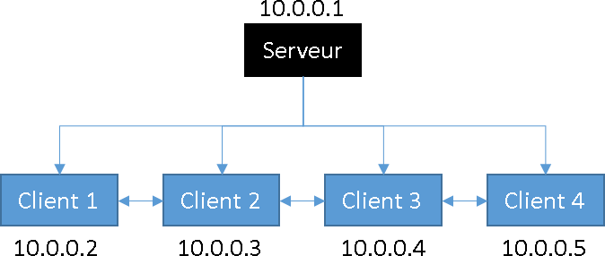

#SyncVideoPi
Ce projet a pour but de fournir un système multi-écran basé sur des raspberry PI. Chaque raspberry est relié à un écran et affiche seulement la partie correspondant à sa position dans la géométrie globale du mur d'écran.

##Comment utiliser
Pour utiliser ce programme, il faut passer par plusieurs étapes. Le système utiliser le réseau pour distribuer le programme et les médias. La première étape consiste donc à configurer le réseau. Le système repose sur la synchronisation temporelle, il faut donc installer et configurer NTP sur les raspberry. Le partage des médias est basé sur NFS, il faut donc le configurer. La dernière étape consiste à installer le programme en lui même et à le configurer.

###Le réseau
Voici l'architecture que nous souhaitons obtenir (4 écrans):



La première chose à faire est de définir de manière statique les adresses IP de chaque Raspberry Pi.
Il faut modifier le fichier : */etc/network/interfaces* 

Voici les lignes qui doivent être présentes dans le fichier pour l'ordinateur 10.0.0.1 :

```
auto eth0
iface eth0 inet static
address 10.0.0.1
netmask 255.255.255.0
network 10.0.0.0
broadcast 10.0.0.255
```

Une fois le fichier modifier il faut redémarrer l'interface eth0.

###NTP
L'architecture que nous voulons obtenir est présentée dans le schéma précédent.
Chaque client est connecté au serveur et à tous les autres clients.

Les paquets NTP sont présents par défaut dans la distribution Raspbian utilisée sur les Raspberry Pi.
Il ne reste plus qu'à modifier les fichiers de configuration afin d'obtenir l'architecture souhaitée.
Le fichier en question est : */etc/ntp.conf*

*Fichier serveur*
```
# Si l'on souhaite se synchroniser avec un serveur via internet
server 0.debian.pool.ntp.org iburst

# Les deux lignes suivantes permettent de définir l'heure locale comme l'heure de référence et donc pouvoir la partager.
server 127.127.1.0 prefer iburst minpoll 4 maxpoll 4
fudge 127.127.1.0 stratum 10
```

*Fichier client*
```
server 10.0.0.1 prefer iburst minpoll 4 maxpoll 4

# Les lignes suivantes permettent de définir les pairs auxquels le client se connecte.
# Ces lignes sont valables pour le client en 10.0.0.2, il y a une ligne à changer en fonction du client
peer 10.0.0.3 minpoll 4 maxpoll 4
peer 10.0.0.4 minpoll 4 maxpoll 4
peer 10.0.0.5 minpoll 4 maxpoll 4
```

*Options utilisées* 

*iburst*			: en cas d'indisponibilité du serveur, ntp essaiera plusieurs fois avant d'abandonner. 
*prefer* 			: le serveur est préféré vis à vis des autres serveurs.
*minpoll/maxpoll* 	: interval entre chaque obtention de l'heure en puissance de 2, 4 <= poll <= 16. maxpoll = 4, demande de l'heure toutes les 16 secondes.

*Utilitaires* 

*ntpq -pn* : permet de vérifier le décalage d'horloge par rapport au serveur.

Une fois le fichier modifier il faut redémarrer sur chaque Raspberry les démons NTP à l'aide de :
```sudo service ntp restart```

Il faut ensuite attendre un certain temps avant que la synchronisation s'effectue. Si elle prend du temps, redémarrer les Raspberry Pi clients.


###NFS

*Configuration serveur*

Le paquet serveur NFS n'est pas présent sur la distribution Raspbian OS.
Il faut l'installer à l'aide de :
```sudo apt-get install nfs-kernel-server```

Il faut à présent ajouter le chemin du dossier à partager dans le fichier : */etc/exports*

```cheminDossierPartageServeur *(rw,all_squash,no_subtree_check,anonuid=1000,anongid=1000,sync)```

Il faut ensuite lancer le démon rpcbind sur le serveur NFS à l'aide de :

```sudo update-rc.d rpcbind enable```

Enfin il faut relancer les démons que l'on vient de configurer à l'aide de :
```
sudo service rpcbind restart
sudo service nfs-kernel-server restart
```

*Configuration client*

Le paquet client NFS est présent par défaut sur la distribution Raspbian OS.
Il faut tout d'abord créer un dossier qui servira de point de montage.

Il suffit ensuite d'éditer le fichier : */etc/fstab* pour ajouter le montage.
La ligne suivante est à ajouter :
```adresseServeur:cheminDossierPartageServeur cheminPointMontageClient nfs rw, nolock,auto 0 0```

Le montage à l'allumage n'est pas toujours automatique, il faut alors lancer sur chaque client la commande :
```sudo mount -a```

###Le programme
####L'installation
Pour installer le programme, cloner le dépôt github, copier le dossier *install/* sur chacun des raspberry. Exécuter ensuite ensuite le script *install.sh* avec les droits d'administrateur. 


```scp -r install/ pi@piaddress:/home/pi/```

Sur les raspberry:
*```cd /home/pi/install```*
*```sudo ./install.sh```*

####Utilisation
*Configuration géométrie*

Une fois le programme installer sur chacun des raspberry, il faut configurer la gémoétrie. Pour chacun des écrans, il faut mesurer leur taille et leur position dans le mur. Il faut également connaître la taille du mur d'acran. il faut créer un fichier texte suivant l'exemple ci-dessous.

```
wallWidth       1005
wallHeight      610

tileWidth       475
tileHeight      300

tileX   0
tileY   310
```

*Configuration programmation*

Pour indiquer à quelle heure les médias doivent s'afficher sur le mur d'écran, il faut indiquer le résultat attendu dans un fichier texte respectant ce format. 

```
VIDEO NFS_Folder/video.mp4 2014/02/08/19:00:00 2014/02/08/20:59:00 NO_LOOP
VIDEO NFS_Folder/video2.mov 2014/02/08/20:59:00 2014/02/08/22:00:00 LOOP
IMAGE NFS_Folder/image.png 2014/02/08/22:00:00 2014/02/08/23:00:00
```
Le fichier ci-dessus indique que le média *vidéo.mp4* doit être afficher sur les écrans entre 19h et 20h59 le 8 février 2014 et que la vidéo ne doit pas reprendre au début si elle est finie. Viendra ensuite la vidéo2.mov qui elle sera lue en boucle et enfin l'image qui sera affichée entre 22h er 23h. Comme le programme doit être commun à tous les raspberry, il est préférable de le mettre sur le dossier NFS partagé.

*Lancement
Une fois tout configurer, il ne reste plus qu'a exécuter le programme sur tous les raspberry.
```videosync configScreen.cf programm.pr```

##Comment compiler
Le code a été conçu pour être cross-compiler. Pour rendre le processus plus simple et ne pas avoir à copier toutes les librairies et header depuis le raspberry PI vers l'ordinateur compilant, nous allons monter l'ensemble le dossier racine du raspberry en NFS. Pour cela, il faut rajouter la ligne ```/ 10.0.0.0/24(rw,no_root_squash,async,no_subtree_check)``` dans le fichier ```/etc/export``` avec 10.0.0.0 le réseau correspondant. Ensuite, sur l'ordintaue devant compiler il faut monter le dossier comme ceci:
```
mkdir nfsFolder
sudo mount -t nfs 10.0.0.1:/ nfsFolder
```
Il faut également récupérer les outils de cross compilation (sur le github de Raspberry Pi par exemple).
Il faut ensuite modifier le fichier *Makefile.include* avec ses propres variables. Ainsi, il faut indiquer :
*```BUILDROOT	:=/home/erwan/rpi/nfs``` avec /home/erwan/rpi/nfs étant le chemin d'accès vers le repertoire où est monté en NFS la racine du raspberry.
*```TOOLCHAIN	:=/usr/local/bcm-gcc/tools/arm-bcm2708/gcc-linaro-arm-linux-gnueabihf-raspbian``` avec le chemin d'accès vers l'outil de cross compilation
*```HOST		:=arm-linux-gnueabihf``` pour indiquer le dossier contenant les exécutable de compilation

Ensuite, il ne reste plus qu'à compiler avec :
```sudo make dist```

Il y aura probablement des problèmes de bibliothèques manquantes, mais il suffit de les installer au cas par cas sur le raspberry avec aptitude par exemple.

